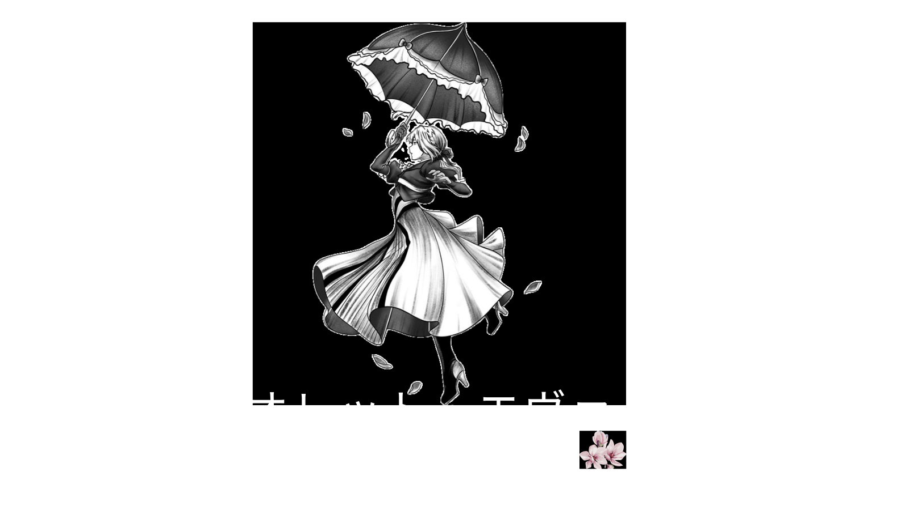

# 💜 Violet Evergarden - A Emoção em Cada Letra  
*"Assim como Violet aprendeu a traduzir sentimentos em palavras, este projeto marca o início da minha jornada no mundo do código."*  

  
*(Violet escrevendo, frame a frame, assim como cada linha do seu código!)*  

🎵 **[Ouça a Trilha Sonora Enquanto Explora](https://youtu.be/9W4Kf8W5F7Q?si=JqPQZzZ8QlDzq7Qx)** *(Violet Evergarden OST - "The Voice in My Heart")*  

---

### 🌸 **O Que Este Projeto Representa?**  
- **Primeiros Passos:** Como Violet segurando sua caneta pela primeira vez, eu descobri o poder do HTML/CSS.  
- **Beleza na Simplicidade:** Cores suaves e elementos minimalistas, inspirados nas paisagens da série.  
- **Emoção em Cada Detalhe:** Até o menor `margin: auto;` foi ajustado com cuidado, como uma carta manuscrita.  

---

## 💌 Cartas dos Visitantes  
*"Deixe sua mensagem, como uma carta para o futuro."*  

[📩 Clique aqui para escrever sua carta](https://github.com/Sa-briina/projeto-violet-evergarden/issues/new?template=cartas.md&title=Carta+de+%5BSeu+Nome%5D)  

*(As cartas serão publicadas como [Issues](https://github.com/Sa-briina/projeto-violet-evergarden/issues) aqui no GitHub!)*  

---

🛠 **Tecnologias Usadas:**  
  
  

---

### 📜 **Como Executar?**  
```bash
git clone https://github.com/Sa-briina/projeto-violet-evergarden.git  
cd projeto-violet-evergarden  
abra index.html  
